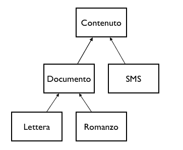

# principio di sostituzione di Liskov

Supponiamo di aver appena definito la classe <mark style="color:red;">`Documento`</mark> e di aver successivamente generato le classi <mark style="color:red;">`Lettera`</mark>, <mark style="color:red;">`SMS`</mark> e <mark style="color:red;">`Romanzo`</mark> come classi figlie della classe Documento.

Il principio che trattiamo in questa lezione, enunciato per la prima volta da **Barbara Liskov** nel 1987, asserisce che ovunque nel nostro codice sia richiesto un oggetto di tipo <mark style="color:red;">`Documento`</mark> debba essere possibile utilizzare un qualsiasi oggetto istanziato da una delle classi figlie di <mark style="color:red;">`Documento`</mark>, come ad esempio <mark style="color:red;">`SMS`</mark>, senza pregiudicare in alcun modo il buon funzionamento del programma.

La definizione formale del principio **Liskov Substitution** è espressa in questo modo:

“ Se per ogni oggetto o1 di tipo S c'è un oggetto o2 di tipo T, tale che per tutti i programmi Pdefiniti in termini di T, il comportamento di P non vari sostituendo o1 a o2, allora S è un sottotipo di T ”

### Come è facile violare l'LSP <a href="#come-e-facile-violare-l-lsp" id="come-e-facile-violare-l-lsp"></a>

Definiamo i metodi della classe Documento:

```java
classe Documento
   string getTitolo()
   void   setTitolo(string titolo)
   string getTesto()
   void   setTesto(string testo)
```

Ora descriviamo un metodo di una classe <mark style="color:red;">`Storage`</mark> che, ricevuto un oggetto di tipo Documento, si preoccupa salvare su disco rigido il contenuto dello stesso:

```java
classe Storage
   void salvaSuDisco(doc)
       testo = doc.getTitolo() + " " + doc.getTesto()
       scriviIlFile(rimuoviGliSpazi(doc.getTitolo()) + ".txt", testo)va
```

Ok, ora concentriamoci sulla classe <mark style="color:red;">`SMS`</mark>, in una prima istanza potremmo pensare di aggiungere due nuovi metodi per la gestione del dato <mark style="color:red;">`destinatario`</mark>:

```java
classe SMS che deriva da Documento
  // oltre ai metodi della classe Documento, che sono automaticamente inclusi in SMS
  string getDestinatario()
  void setDestinatario(string numero_di_telefono)
```

A questo punto ipotizziamo di creare un oggetto di tipo <mark style="color:red;">`SMS`</mark>:

```java
messaggio = new SMS()
messaggio.setDestinatario("555 100 666")
messaggio.setTesto("Winter is coming")
```

e di volerlo salvare su disco:

```java
disco_usb = new Storage()
disco_usb.salvaSuDisco(messaggio)
```

Riceviamo un messaggio come questo:

```
[!] ERRORE, non posso creare un file con nome ".txt"
```

Cosa è successo? Semplice, un attributo esposto dalla classe padre (<mark style="color:red;">`Titolo`</mark>) non viene utilizzato dalla classe figlia ma viene richiesto da alcune funzioni che lavorano con oggetti di tipo <mark style="color:red;">`Documento`</mark>. La classica, e sbagliata, soluzione per questo genere di problematiche è la seguente:

```java
classe Storage
  void salvaSuDisco(doc)
    se doc è di tipo SMS
      testo = doc.getDestinatario() + " " + doc.getTesto()
      scriviIlFile(rimuoviGliSpazi(doc.getDestinatario()) + ".txt", testo)
    altrimenti
      testo = doc.getTitolo() + " " + doc.getTesto()
      scriviIlFile(rimuoviGliSpazi(doc.getTitolo()) + ".txt", testo)
```

Il motivo per cui è richiesta aderenza al principio di Liskov gravita attorno al tipo di intervento che abbiamo appena effettuato: iniettando un controllo esplicito sulla tipologia dell'oggetto sul quale la funzione insiste abbiamo violato l'open/close principle. La classe <mark style="color:red;">`Storage`</mark> è ora infatti aperta rispetto a <mark style="color:red;">`Documento`</mark> ed a tutte le classi figlie. Questo significa che modifiche/aggiunte alla gerarchia della classe <mark style="color:red;">`Documento`</mark> dovranno necessariamente comportare la modifica del metodo <mark style="color:red;">`salvaSuDisco`</mark>.

### La soluzione

Per gestire questo tipo di situazioni è di solito sufficiente identificare dove il comportamento della classe padre diverge in modo troppo consistente rispetto a quello della classe figlia e decidere in che modo operare:

#### <mark style="color:purple;">**Astrarre**</mark> <a href="#astrarre" id="astrarre"></a>

**Generalizzare la classe padre**, fino ad astrarla se necessario, in modo da eliminare quegli aspetti\
che sono in conflitto con la classe figlia. Questa soluzione comporta però la necessità di reimplementare\
l'aspetto rimosso all'interno delle classi figlie che ne beneficiavano realmente,\
rischiando di incorrere in pericolose duplicazioni di codice.

#### <mark style="color:purple;">Rinunciare all'ereditarietà</mark> <a href="#rinunciare-all-ereditarieta" id="rinunciare-all-ereditarieta"></a>

**Rimuovere la relazione tra classe padre e classe figlia**. In questo modo però si perdono tutti\
i benefici derivanti dall'ereditarietà: tutti i metodi studiati per la classe padre che possono andar\
bene anche per la classe appena separata devono essere riscritti.

#### <mark style="color:purple;">Creare un nuovo livello</mark> <a href="#creare-un-nuovo-livello" id="creare-un-nuovo-livello"></a>

**Creare una nuova classe padre**, ad esempio <mark style="color:red;">`Contenuto`</mark> e spostare la classe figlia sotto questa. Generalizzare poi <mark style="color:red;">`Contenuto`</mark> fino a renderlo compatibile con il comportamento di <mark style="color:red;">`SMS`</mark>.

Creare una nuova classe padre



#### <mark style="color:purple;">Implementare le differenze nella classe base</mark> <a href="#implementare-le-differenze-nella-classe-base" id="implementare-le-differenze-nella-classe-base"></a>

Implementare la dissonanza direttamente all'interno della classe padre ed utilizzare l'overriding nella classe figlia per definirne il diverso comportamento.

Ad esempio, la classe <mark style="color:red;">`Documento`</mark> potrebbe essere ridefinita come segue:

```java
classe Documento
  string stampa()
    ritorna titolo + " " + testo
  string titoloFile()
    ritorna rimuoviGliSpazi(titolo) + ".documento.txt"
```

mentre la classe <mark style="color:red;">`SMS`</mark> potrebbe contenere la propria versione di <mark style="color:red;">`stampa()`</mark>:

```java
classe SMS che deriva da Documento
  string stampa()
    ritorna destinatario + " " + testo
  string titoloFile()
    ritorna rimuoviGliSpazi(destinatario) + ".sms.txt"
```

La funzione <mark style="color:red;">`salvaSuDisco`</mark> a questo punto potrebbe limitarsi ad invocare i metodi appena definiti, delegando ai singoli oggetti le corrette implementazioni:

```java
classe Storage
  void salvaSuDisco(doc)
    scriviIlFile(doc.titoloFile(), doc.stampa())
```

### Conclusioni <a href="#conclusioni" id="conclusioni"></a>

Il principio di Liskov è importantissimo anche in funzione della sua stretta correlazione con il principio Open/Close che abbiamo visto nella lezione precedente. Un software che non rispetta questo principio rischia di sviluppare un alto grado di viscosità e rigidità in breve tempo.
